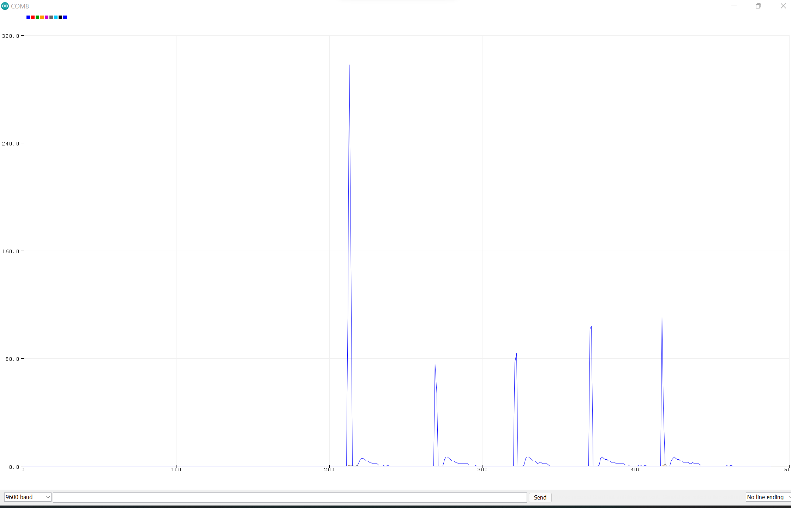

<!--- 
### Abstract

A mini handpan was built with pop cans, pizeoelectric sensors, and a Arduino Mega 2560 microcontroller. add more when finished 
-->

### Introduction

Handpan instrument is a group of metallic percussion instruments played with hands that are similar to Hang® (cre­at­ed by PANArt tuners Sabi­na Schär­er and Felix Rohn­er in 2000 in Switzer­land[^1]), consisting of two hemispherical shells of nitrided or stainless steel. Its extraordinary sound is often described as calming and peaceful, which can be used for stress-release[^2]. Originated from the Caribbean steelpan instrument, a handpan typically has 8-9 notes in a pentatonic scale. Figure 1 is a sample image of a free integral Hang® built by PANArt, where seven harmonically tuned notes are around a central deep tone, which "excites the Helmholtz (cavity) resonance of the
body of the instrument"[^3][^4]. Figure 2 is a sample tuning scale[^5]. It can be turned in a wide range of scales, some examples are illustrated in Figure 3[^6]. 

<p align="center">
  
  <figcaption align = "center"><b>Figure 1. The side, top, and bottom view of a Hang®.</b></figcaption>
</p>
<p>&nbsp;</p>
<p align="center">
   
  <figcaption align = "center"><b>Figure 2. A sample tuning scale beginning with D3 note in the center.</b></figcaption>
</p>
<p>&nbsp;</p>
<p align="center">
  
  <figcaption align = "center"><b>Figure 3. Sample tuning scales.</b></figcaption>
</p>

<!---comment<p>&nbsp;</p>-->
Like all the other beautiful handmade instruments in the world, a good quality physical handpan is not easily accessible. Tuning a handpan requires skillful hammering that needs years of practice, because there are nearly 60 parameters to be considered when tuning a sound into steel, according to A. Achong[^3]. Given the fact that tuning steelpans is an intuitive and complicated task, the entire building process of a typical handpan like in Figure 1 usually takes 2-3 months, according to AYASA Instruments, a well-known handpan manufacturer in Netherlands[^7]. The complete process is described in a blog post by Sylvan Paslier[^8]. Since there are not many experienced tuners of this young instrument, and the demand is still increasing, a good handpan with 8 or 9 notes typically costs 3~4k CAD (before tax and shipping). In addition, it is not easy to carry around as the diameter is around 55 cm and it weighs nearly 5 kg without the case. Therefore, for this project, a mini handpan was built with pop cans, pizeoelectric sensors, and a arduino microcontroller, which is much more accessible to the public and ideal for practice purpose.

<!---<p>&nbsp;</p>
This Ceramic Piezo Vibration Piece Sensor buffers a piezoelectric transducer that responds to strain changes by generating a measurable output voltage change which is proportional with the strength of vibration. So you can know the extent of vibration. Different from digital vibration sensor that only accounts times, this analog one can tell extent of vibration.
When the piezoelectric ceramic shocking will generate an electrical signal, controller analog port can be perceived slight vibration signals, also can be realized with vibration interactions related works, such as electronic drums.
Working Voltage: 3.3V or 5V. Working Current: 1mA. Interface Type: Analog Output.
Please connect analog voltage ceramic vibration sensor to the UNO controller's analog port A0 in accordance with the procedure, then observe the output value of serial port when the vibration degree is different, it can realize interactive works related to the vibration.
Strong After-sales Service Team: As long as you have any questions about the product, we will resolve your issue immediately if received your email, your satisfactory purchase experience is our greatest hope! How to email us? Plz click “MakerHawk-US” and click “Ask a question” to email us! Looking forward to your consultation!
https://www.amazon.ca/gp/product/B07KS5NV4V/ref=ppx_yo_dt_b_asin_title_o07_s00?ie=UTF8&th=1
-->

### Methods

To construct a mini handpan, instead of the natural sound generated by the cavity, an electronic version should be considered, given the small size of the plan. Thanks to the development of _Musical Instrument Digital Interface_, or MIDI, a wide range of instruments can be played in a small interface. MIDI is a standard way to convey music performance information, including playing, editing, and recording music, through electronic data called MIDI messages[^9]. A MIDI message contains a status byte and two data bytes. For this project, the following information is needed: a synthesized musical sounds with timbre similar to handpans, and on/off triggering of the note to be played. According to the standardized specification, _General MIDI_, the sound of a variety of instruments is selected based on a _program change_ of the _channel message_, and the sound of steel drums (a "cousin"[^10] of the handpan) with _program number_ 115 is a reasonable choice. As for triggering the note, it is simply NOTE-ON/OFF events in _chanel message_, specifying the _note number_ (pitch or frequency) and _note velocity_ (dynamics). Now the question comes to how to send these MIDI messages, which can be accomplished by the _Serial_ functionality in Arduino and the _serial_ object in Max/MSP[^11].

Arduino is an open-source platform based on their microcontroller boards, programming and processing tools (Arduino Software (IDE)) for electronics projects. Max/MSP is a visual programming environment for music and multimedia production. Rather than sending the actual MIDI message, here, MIDI byte values are programmed as space-separated integers in Arduino, and they are received by the _serial_ object in Max, which are then converted to a list of numbers and sent to the _midiout_ object. Therefore, by defining different parameters of MIDI messages, one could personalized their handpan with any notes or any scales with any sound in MIDI programs they want to play. The sample code of Arduino and Max are attached in Appendix A and B respectively, and the Max patch is illustrated in Figure 4. 

<p align="center">
  
  <figcaption align = "center"><b>Figure 4. The Max patch of arduino MIDI in.</b></figcaption>
</p>

Since we would like to trigger MIDI events when we actually "play" or touch the mini handpan model, just like playing a real handpan, piezoelectric sensors need to be introduced.

Pizeoelectric Sensors are active sensors in which the mechanical quantities (such as force, strain, pressure, acceleration, and acoustic emission) applied to the transduction element made of a piezoelectric material yields an electric charge due to the piezoelectric effect - a proportional change in the electric polarization of the piezoelectric material resulting from a mechanical deformation[^12]. Sensing materials include single crystals, piezoelectric ceramics, textures and thin films. Because of the high frequency, wide measuring range, high stability and many other advantages, these sensors are widely used in our daily life, including fire alarms, microwave ovens, microphones, just to name a few. Figure 5 is the Ceramic Piezo Vibration Sensor Module used for this project. It consists of a piezoelectric ceramics sensor and a breadboard-friendly pc board, purchased from Amazon[^13].

<p align="center">
  
  <figcaption align = "center"><b>Figure 5. A Ceramic Piezo Vibration Sensor Module.</b></figcaption>
</p>

Since the strain change of the piezoelectric sensor is an analogue input, and a handpan has at least 8 notes, an Arduino Mega 2560 board with 16 analog inputs and 54 digital input/output pins was used, as shown in Figure 6[^14].

<p align="center">
  
  <figcaption align = "center"><b>Figure 6. The Arduino Mega 2560 board.</b></figcaption>
</p>

Regarding the interface, in consideration of handpans' material (steel) and their drum-nature, and inspired by the Arduino project [Playable Drum Set by SunFounder Maker Education](https://youtu.be/UVISquEcuzg), mini Coke cans were used for building the physical model. Table 1 lists all the materials used for building the mini handpan, and Figure 7 illustrates the designed circuit.

<table>
<thead> <b>Table 1. List of materials used for the project.</b>
<tr>
<th>No.</th>
<th>Component Name</th>
<th>Model</th>
<th>Quantity</th>
</tr>
</thead>
<tbody>
<tr>
<td>1</td>
<td>Pop Cans</td>
<td>Coca-Cola mini</td>
<td>8</td>
</tr>
<tr>
<td>2</td>
<td>Can Opener</td>
<td>Starfrit</td>
<td>1</td>
</tr>
<tr>
<td>3</td>
<td>Piezoelectric Sensor</td>
<td>MakerHawk Analog Ceramic Piezo Vibration Sensor Module</td>
<td>9</td>
</tr>
<tr>
<td>4</td>
<td>Arduino Microcontroller Board</td>
<td>ELEGOO Mega 2560 R3</td>
<td>1</td>
</tr>
<tr>
<td>5</td>
<td>Breadboard</td>
<td>ELEGOO</td>
<td>3</td>
</tr>
<tr>
<td>6</td>
<td>Jumper Wires</td>
<td>ELEGOO</td>
<td>many</td>
</tr>
<tr>
<td>7</td>
<td>Hot Glue Gun</td>
<td>SOONAN</td>
<td>1</td>
</tr>
<tr>
<td>8</td>
<td>Computer</td>
<td>Equipped with Arduino IDE and MAX/MSP</td>
<td>1</td>
</tr>
</tbody>
</table>


<p align="center">
  
  <figcaption align = "center"><b>Figure 7. The breadboard diagram of the mini handpan circuit, designed in <i>Fritzing</i>.</b></figcaption>
</p>

### Results

By cutting the cover and cylindrical shell of 8 pop cans, a mini handpan prototype was built as in Figure 8. Then after connecting the wires and modules, the circuit was built successfully as in Figure 9 and 10.

<p align="center">
  
  <figcaption align = "center"><b>Figure 8. The prototype of the mini handpan.</b></figcaption>
</p>

<p align="center">
  
  <figcaption align = "center"><b>Figure 9. The built circuit.</b></figcaption>
</p>

<p align="center">
  
  <figcaption align = "center"><b>Figure 10. The mini handpan.</b></figcaption>
</p>

To trigger the NOTE ON event, a threshold value was determined by touching the sensor plate with the same force applied repeatedly and averaging out the peak values of the analogue readings for each sensor. A sample test is shown in Figure 11. As can be seen from the graph, the touch is like an impulse response, and as long as the sensor is touched by hand, a sudden peak of the sensor value appears and there is a time elapse for each touch. If the event is triggered simply by exceeding a threshold value, the attack is not a stable value to use; as if we accidentally touch the wire of the sensor, there would be a sudden attack and the event would be triggered. This is demonstrated in video 1. Therefore, the the output is filtered with low pass filter to make it more smooth. Also, the triggering should be on only when there is a touch, i.e. the threshold is exceeded for a certain amount of time, to avoid accidental attacks. Figure 12 demonstrates the original response in blue and the filtered response in red, which is much more smooth. All the code are shown in Appendix A, and the modified version of how each sensor responses is illustrated in Video 2.

<p align="center">
  
  <figcaption align = "center"><b>Figure 11. The threshold value test for sensor A0.</b></figcaption>
</p>

<!--
	<a href="{https://youtu.be/NYNq7K48NYc}" title="Video1. Suddent Attack"></a>
	<p align="center">
	[](https://youtu.be/NYNq7K48NYc "Video 1. Sudden Attack Effects")
	</p>
	<video width="400" controls>
	<source src="ttps://youtu.be/NYNq7K48NYc" type="video/mp4">
	<source src="mov_bbb.ogg" type="video/ogg">
	Your browser does not support HTML video.
	</video>
-->

<iframe width="420" height="315"
src="https://youtu.be/NYNq7K48NYc">
</iframe>
<p>
<a href="https://youtu.be/NYNq7K48NYc" target="_blank">Video 1. Sudden Attack Effects.</a>.
</p>

<p align="center">
  
  <figcaption align = "center"><b>Figure 12. The filtered response of sensor A0.</b></figcaption>
</p>

<iframe width="420" height="315"
src="https://youtu.be/e8lEwJxMvLI">
</iframe>
<p>
<a href="https://youtu.be/e8lEwJxMvLI" target="_blank">Video 2. Demo of each note being played.</a>.
</p>


### Discussion

Video 2 shows a relative accurate response as sensors being touched by fingers, simulating playing an actual handpan, with the low pass filter and time elapsed conditions. However, it has limitations which can be investigated further and improved. First is that it only works well for slow practice due to the time elapsed condition, where the interval was set to 800 ms according to one impulse response of the sensor, which means only one note will be played if two or more consecutive touch of the same sensor are within that range. This can be modified by detecting the peak value of the sensor, where for a certain amount of the time, the note-on event will be triggered as long as there is a peak compared with its previous and later responses (excluding the sudden attack), rather than using a fixed threshold value. As for now if the sensor is pressed for a long time (longer than the set interval), it will trigger a periodic note-on/off event for every time interval elapses, which may not be ideal unless the player wants to play a loop.

Another obstacle is that the volume was set to the maximum (127) for each note and each touch as long as the if condition (exceeding the threshold for certain times) is satisfied; while as demonstrated in Video 2, the volume was not the same for each touch, which may due to the hardware of the laptop or the software issue. It can be tested in other computers to check the problem, and the volume may be adjusted based on the force applied, in order to simulate a more realistic playing experience. Furthermore, if the player would like to use the real handpan sound, it can be achieved by implementing the audio files of each note number into Max or Arduino, still, for a more realistic practice.

### Conclusion

Overall, a mini handpan was built successfully with the MIDI communication between Arduino and Max/MSP, the piezoelectric sensor modules, and the pop cans. It can be personalized in any note number and thus any scales, and any instruments within the MIDI specifications. It is affordable, adjustable, and portable, ideal for slow practice. It can be further investigated, for example, for a better  piezoelectric sensor response in terms of accuracy, volume, and dynamics, and other features like built-in songs for practice can be implemented in the future.


[^1]: PANArt. ‘Copyright: Questions and Answers’. Panart (en). Accessed 1 December 2021. https://panart.ch/en/articles/copyright-questions-and-answers.

[^2]: Malzer, Clara. ‘The Magic of The Handpan: The Instrument For Stress-Release And Harmony’. The Conscious Club. Accessed 1 December 2021. https://theconsciousclub.com/articles/2019/10/24/the-magic-of-the-handpan-the-instrument-for-stress-release-and-harmonynbsp.

[^3]: Rohner, Felix, and Sabina Schärer. ‘History, Development and Tuning of the Hang’, 2007. http://www.hangblog.org/panart/Paper-Hang-2007.pdf.

[^4]: ‘File:Panart-Freies-Integrales-Hang.Jpg - Wikipedia’. Accessed 1 December 2021. https://commons.wikimedia.org/wiki/File:Panart-freies-integrales-hang.jpg.

[^5]: Wessel, David, Andrew Morrision, and Thomas D. Rossing. ‘SOUND OF THE HANG’. ACOUSTICS.ORG, 4 July 2008. https://acoustics.org/pressroom/httpdocs/155th/wessel.htm.

[^6]: Rossing, Thomas D., Andrew Morrision, Uwe Hansen, Felix Rohner, and Sabina Schärer. ‘ACOUSTICS OF THE HANG: A Hand-Played Steel Instrument’, 2007. http://www.hangblog.org/panart/2-S2-4-IsmaRossing.pdf.

[^7]: ‘Ayasa - Acquire an Instrument’. Accessed 1 December 2021. https://ayasainstruments.com/acquire-an-ayasa.

[^8]: Paslier, Sylvain. ‘How Are Handpans Made? A Step-by-Step Guide’. sylvainpasliermusic, 22 August 2019. https://www.sylvainpasliermusic.com/post/how-are-handpans-made.

[^9]: Scavone, Gary P. ‘MIDI’. Accessed 1 December 2021. https://www.music.mcgill.ca/~gary/306/week2/node3.html.

[^10]: Morrison, Andrew, and Thomas D. Rossing. ‘The Extraordinary Sound of the Hang’. Physics Today 62, no. 3 (March 2009): 66–67. https://doi.org/10.1063/1.3099586.

[^11]: Scavone, Gary P. ‘Interfacing the Arduino to Max/MSP’. Accessed 1 December 2021. https://www.music.mcgill.ca/~gary/306/week5/node7.html.

[^12]: Gautschi, Gustav. ‘Introduction’. In Piezoelectric Sensorics: Force Strain Pressure Acceleration and Acoustic Emission Sensors Materials and Amplifiers, edited by Gustav Gautschi, 1–3. Berlin, Heidelberg: Springer, 2002. https://doi.org/10.1007/978-3-662-04732-3_1.

[^13]: ‘MakerHawk 4pcs Analog Ceramic Piezo Vibration Sensor Module 3.3V/5V for Arduino DIY Kit: Amazon.Com: Industrial & Scientific’. Accessed 1 December 2021. https://www.amazon.com/MakerHawk-Analog-Ceramic-Vibration-Arduino/dp/B07KS5NV4V.

[^14]: Arduino Online Shop. ‘Arduino Mega 2560 Rev3’. Accessed 1 December 2021. http://store-usa.arduino.cc/products/arduino-mega-2560-rev3.

<!--- 
PANArt. ‘Hang®’. Panart (en). Accessed 1 December 2021. https://panart.ch/en/instruments/sound-sculpture-hang. 
Rossing, Thomas D., Uwe J. Hansen, Felix Rohner, and Sabina Schärer. 2001. “The HANG: A Hand Played Steel Drum.” The Journal of the Acoustical Society of America 110 (5): 2649–49. https://doi.org/10.1121/1.4809019.

-->


### Appendix A. Sample Code of Arduino.

```
#define MIDI_ON 144
#define MIDI_OFF 128
#define MIDI_PROGRAM 192
#define MIDI_CHANNEL 0

#define DRUM_CHANNEL 9

#define SteelDrum 114
#define D3 50
#define A_3 57
#define Bb3 58
#define C4 60
#define D4 62
#define E4 64
#define F4 65
#define G4 67
#define A_4 69

const int NOTE0 = A0;int Note0Val = 0;
const int NOTE1 = A1;int Note1Val = 0;
const int NOTE2 = A2;int Note2Val = 0;
const int NOTE3 = A3;int Note3Val = 0;
const int NOTE4 = A4;int Note4Val = 0;
const int NOTE5 = A5;int Note5Val = 0;
const int NOTE6 = A6;int Note6Val = 0;
const int NOTE7 = A7;int Note7Val = 0;
const int NOTE8 = A8;int Note8Val = 0;

int value;

const int threshold = 3; //

#include <elapsedMillis.h>
elapsedMillis timeElapsed; //declare global if you don't want it reset every time loop runs
unsigned int interval = 800;

int x0 = 0;
int x1 = 0;
int x2 = 0;
int x3 = 0;
int x4 = 0;
int x5 = 0;
int x6 = 0;
int x7 = 0;
int x8 = 0;

int test = 100;

int x0n = 0;
int x1n = 0;
int x2n = 0;
int x3n = 0;
int x4n = 0;
int x5n = 0;
int x6n = 0;
int x7n = 0;
int x8n = 0;

int y0 = 0;
int y1 = 0;
int y2 = 0;
int y3 = 0;
int y4 = 0;
int y5 = 0;
int y6 = 0;
int y7 = 0;
int y8 = 0;

int y0n = 0;
int y1n = 0;
int y2n = 0;
int y3n = 0;
int y4n = 0;
int y5n = 0;
int y6n = 0;
int y7n = 0;
int y8n = 0;

// midi2Max function declaration with optional arguments
void midi2Max( int cmd, int data1 = -1, int data2 = -1 );

void setup() {
  Serial.begin(9600);// set the MIDI baud rate
}

void loop() {// put your main code here, to run repeatedly:
  if(Serial.available()){
    value = Serial.read();}

  Note0Val = analogRead(A0);
  x0 = Note0Val;
  y0 = 0.7*y0n+0.3*(x0+x0n);
  x0n = x0;
  y0n = y0;
  if (y0 >= threshold && timeElapsed > interval){
    midi2Max( MIDI_PROGRAM + MIDI_CHANNEL, SteelDrum );
    midi2Max( MIDI_ON, D3, 127 );
    midi2Max( MIDI_OFF, D3, 127 );
    timeElapsed = 0;
  }

  Note1Val = analogRead(A1);
  x1 = Note1Val;
  y1 = 0.7*y1n+0.3*(x1+x1n);
  x1n = x1;
  y1n = y1;
  if (y1 >= threshold && timeElapsed > interval){
    midi2Max( MIDI_PROGRAM + MIDI_CHANNEL, SteelDrum );
    midi2Max( MIDI_ON, A_3, 127 );
    midi2Max( MIDI_OFF, A_3, 127 );
    timeElapsed = 0;
    }

  Note8Val = analogRead(A8);
  x8 = Note8Val;
  y8 = 0.7*y8n+0.3*(x8+x8n);
  x8n = x8;
  y8n = y8;
  if (y8 >= threshold && timeElapsed > interval){
    midi2Max( MIDI_PROGRAM + MIDI_CHANNEL, SteelDrum );
    midi2Max( MIDI_ON, Bb3, 127 );
    midi2Max( MIDI_OFF, Bb3, 127 );
    timeElapsed = 0;
    }

  Note2Val = analogRead(A2);
  x2 = Note2Val;
  y2 = 0.7*y2n+0.3*(x2+x2n);
  x2n = x2;
  y2n = y2;
  if (y2 >= threshold && timeElapsed > interval){
    midi2Max( MIDI_PROGRAM + MIDI_CHANNEL, SteelDrum );
    midi2Max( MIDI_ON, C4, 127 );
    midi2Max( MIDI_OFF, C4, 127 );
    timeElapsed = 0;
    }
    
  Note7Val = analogRead(A7);
  x7 = Note7Val;
  y7 = 0.7*y7n+0.3*(x7+x7n);
  x7n = x7;
  y7n = y7;
  if (y7 >= threshold && timeElapsed > interval){
    midi2Max( MIDI_PROGRAM + MIDI_CHANNEL, SteelDrum );
    midi2Max( MIDI_ON, D4, 127 );
    midi2Max( MIDI_OFF, D4, 127 );
    timeElapsed = 0;
    }
    
  Note3Val = analogRead(A3);
  x3 = Note3Val;
  y3 = 0.7*y3n+0.3*(x3+x3n);
  x3n = x3;
  y3n = y3;
  if (y3 >= threshold && timeElapsed > interval){
    midi2Max( MIDI_PROGRAM + MIDI_CHANNEL, SteelDrum );
    midi2Max( MIDI_ON, E4, 127 );
    midi2Max( MIDI_OFF, E4, 127 );
    timeElapsed = 0;
    }
    
  Note6Val = analogRead(A6);
  x6 = Note6Val;
  y6 = 0.7*y6n+0.3*(x6+x6n);
  x6n = x6;
  y6n = y6;
  if (y6 >= threshold && timeElapsed > interval){
    midi2Max( MIDI_PROGRAM + MIDI_CHANNEL, SteelDrum );
    midi2Max( MIDI_ON, F4, 127 );
    midi2Max( MIDI_OFF, F4, 127 );
    timeElapsed = 0;
    }
    
  Note4Val = analogRead(A4);
  x4 = Note4Val;
  y4 = 0.7*y4n+0.3*(x4+x4n);
  x4n = x4;
  y4n = y4;
  if (y4 >= threshold && timeElapsed > interval){
    midi2Max( MIDI_PROGRAM + MIDI_CHANNEL, SteelDrum );
    midi2Max( MIDI_ON, G4, 127 );
    midi2Max( MIDI_OFF, G4, 127 );
    timeElapsed = 0;
    }
    
  Note5Val = analogRead(A5);
  x5 = Note5Val;
  y5 = 0.7*y5n+0.3*(x5+x5n);
  x5n = x5;
  y5n = y5;
  if (y5 >= threshold && timeElapsed > interval){
    midi2Max( MIDI_PROGRAM + MIDI_CHANNEL, SteelDrum );
    midi2Max( MIDI_ON, A_4, 127 );
    midi2Max( MIDI_OFF, A_4, 127 );
    timeElapsed = 0;
    }
  delay(1);  // delay to avoid overloading the serial port buffer
}

// Send a MIDI message of 1 to 3 ``bytes'' (without checking values)

void midi2Max( int cmd, int data1, int data2 )
{
  Serial.print( cmd );
  if ( data1 >= 0 ) {
    Serial.print(' ');
    Serial.print( data1 );
  }
  if ( data2 >= 0 ) {
    Serial.print(' ');
    Serial.print( data2 );
  }
  Serial.println();
}
```

### Appendix B. Sample Code of Max.

```
{
	"boxes" : [ 		{
			"box" : 			{
				"maxclass" : "message",
				"text" : "128 62 127",
				"outlettype" : [ "" ],
				"id" : "obj-25",
				"patching_rect" : [ 201.0, 298.0, 94.0, 22.0 ],
				"numinlets" : 2,
				"numoutlets" : 1
			}

		}
, 		{
			"box" : 			{
				"maxclass" : "newobj",
				"text" : "midiout a",
				"id" : "obj-1",
				"patching_rect" : [ 118.0, 301.0, 51.0, 19.0 ],
				"fontsize" : 9.0,
				"numinlets" : 1,
				"fontname" : "Arial",
				"numoutlets" : 0
			}

		}
, 		{
			"box" : 			{
				"maxclass" : "comment",
				"text" : "Convert back to numbers",
				"id" : "obj-2",
				"patching_rect" : [ 202.0, 267.0, 141.0, 18.0 ],
				"fontsize" : 10.0,
				"numinlets" : 1,
				"fontname" : "Arial",
				"numoutlets" : 0
			}

		}
, 		{
			"box" : 			{
				"maxclass" : "comment",
				"text" : "Convert to ascii",
				"id" : "obj-3",
				"patching_rect" : [ 202.0, 241.0, 141.0, 18.0 ],
				"fontsize" : 10.0,
				"numinlets" : 1,
				"fontname" : "Arial",
				"numoutlets" : 0
			}

		}
, 		{
			"box" : 			{
				"maxclass" : "newobj",
				"text" : "fromsymbol",
				"outlettype" : [ "" ],
				"id" : "obj-4",
				"patching_rect" : [ 118.0, 267.0, 64.0, 19.0 ],
				"fontsize" : 9.0,
				"numinlets" : 1,
				"fontname" : "Arial",
				"numoutlets" : 1
			}

		}
, 		{
			"box" : 			{
				"maxclass" : "newobj",
				"text" : "itoa",
				"outlettype" : [ "int" ],
				"id" : "obj-5",
				"patching_rect" : [ 118.0, 241.0, 40.0, 19.0 ],
				"fontsize" : 9.0,
				"numinlets" : 3,
				"fontname" : "Arial",
				"numoutlets" : 1
			}

		}
, 		{
			"box" : 			{
				"maxclass" : "newobj",
				"text" : "zl group 78",
				"outlettype" : [ "", "" ],
				"id" : "obj-6",
				"patching_rect" : [ 118.0, 214.0, 61.0, 19.0 ],
				"fontsize" : 9.0,
				"numinlets" : 2,
				"fontname" : "Arial",
				"numoutlets" : 2
			}

		}
, 		{
			"box" : 			{
				"maxclass" : "newobj",
				"text" : "select 10 13",
				"outlettype" : [ "bang", "bang", "" ],
				"id" : "obj-7",
				"patching_rect" : [ 118.0, 180.0, 67.0, 19.0 ],
				"fontsize" : 9.0,
				"numinlets" : 3,
				"fontname" : "Arial",
				"numoutlets" : 3
			}

		}
, 		{
			"box" : 			{
				"maxclass" : "comment",
				"text" : "serial port select",
				"id" : "obj-8",
				"patching_rect" : [ 203.0, 22.0, 90.0, 18.0 ],
				"fontsize" : 10.0,
				"numinlets" : 1,
				"fontname" : "Arial",
				"numoutlets" : 0
			}

		}
, 		{
			"box" : 			{
				"maxclass" : "umenu",
				"outlettype" : [ "int", "", "" ],
				"id" : "obj-9",
				"patching_rect" : [ 233.0, 41.0, 48.5, 19.0 ],
				"allowdrag" : 0,
				"fontsize" : 9.0,
				"numinlets" : 1,
				"parameter_enable" : 0,
				"fontname" : "Arial",
				"items" : [ "a", ",", "b", ",", "c", ",", "d", ",", "e", ",", "f", ",", "g", ",", "h" ],
				"numoutlets" : 3
			}

		}
, 		{
			"box" : 			{
				"maxclass" : "button",
				"outlettype" : [ "bang" ],
				"id" : "obj-10",
				"patching_rect" : [ 315.0, 41.0, 15.0, 15.0 ],
				"numinlets" : 1,
				"parameter_enable" : 0,
				"numoutlets" : 1
			}

		}
, 		{
			"box" : 			{
				"maxclass" : "button",
				"outlettype" : [ "bang" ],
				"id" : "obj-11",
				"patching_rect" : [ 19.0, 119.0, 15.0, 15.0 ],
				"numinlets" : 1,
				"parameter_enable" : 0,
				"numoutlets" : 1
			}

		}
, 		{
			"box" : 			{
				"maxclass" : "newobj",
				"text" : "prepend port",
				"outlettype" : [ "" ],
				"id" : "obj-12",
				"patching_rect" : [ 233.0, 70.0, 67.0, 19.0 ],
				"fontsize" : 9.0,
				"numinlets" : 1,
				"fontname" : "Arial",
				"numoutlets" : 1
			}

		}
, 		{
			"box" : 			{
				"maxclass" : "comment",
				"text" : "sample rate (15ms -- 100ms)",
				"linecount" : 2,
				"id" : "obj-13",
				"patching_rect" : [ 102.0, 70.0, 104.0, 29.0 ],
				"fontsize" : 10.0,
				"numinlets" : 1,
				"fontname" : "Arial",
				"numoutlets" : 0
			}

		}
, 		{
			"box" : 			{
				"maxclass" : "number",
				"outlettype" : [ "", "bang" ],
				"id" : "obj-14",
				"tricolor" : [ 0.75, 0.75, 0.75, 1.0 ],
				"patching_rect" : [ 61.0, 69.0, 35.0, 19.0 ],
				"textcolor" : [ 0.0, 0.0, 0.0, 1.0 ],
				"fontsize" : 9.0,
				"htricolor" : [ 0.87, 0.82, 0.24, 1.0 ],
				"numinlets" : 1,
				"parameter_enable" : 0,
				"triscale" : 0.9,
				"fontname" : "Arial",
				"numoutlets" : 2,
				"bgcolor" : [ 0.866667, 0.866667, 0.866667, 1.0 ]
			}

		}
, 		{
			"box" : 			{
				"maxclass" : "slider",
				"outlettype" : [ "" ],
				"id" : "obj-15",
				"size" : 86.0,
				"orientation" : 1,
				"patching_rect" : [ 61.0, 42.0, 127.0, 19.0 ],
				"min" : 15.0,
				"numinlets" : 1,
				"parameter_enable" : 0,
				"numoutlets" : 1
			}

		}
, 		{
			"box" : 			{
				"maxclass" : "toggle",
				"outlettype" : [ "int" ],
				"id" : "obj-16",
				"patching_rect" : [ 19.0, 42.0, 15.0, 15.0 ],
				"numinlets" : 1,
				"parameter_enable" : 0,
				"numoutlets" : 1
			}

		}
, 		{
			"box" : 			{
				"maxclass" : "newobj",
				"text" : "metro 50",
				"outlettype" : [ "bang" ],
				"id" : "obj-17",
				"patching_rect" : [ 19.0, 96.0, 46.0, 19.0 ],
				"fontsize" : 9.0,
				"numinlets" : 2,
				"fontname" : "Arial",
				"numoutlets" : 1
			}

		}
, 		{
			"box" : 			{
				"maxclass" : "newobj",
				"text" : "serial h 9600 8 1 0",
				"outlettype" : [ "int", "" ],
				"id" : "obj-18",
				"patching_rect" : [ 118.0, 152.0, 83.0, 19.0 ],
				"fontsize" : 9.0,
				"numinlets" : 1,
				"fontname" : "Arial",
				"numoutlets" : 2
			}

		}
, 		{
			"box" : 			{
				"maxclass" : "message",
				"text" : "print",
				"outlettype" : [ "" ],
				"id" : "obj-19",
				"patching_rect" : [ 315.0, 70.0, 32.0, 19.0 ],
				"fontsize" : 9.0,
				"numinlets" : 2,
				"fontname" : "Arial",
				"numoutlets" : 1
			}

		}
, 		{
			"box" : 			{
				"maxclass" : "comment",
				"text" : "list serial ports",
				"id" : "obj-20",
				"patching_rect" : [ 312.0, 22.0, 86.0, 18.0 ],
				"fontsize" : 10.0,
				"numinlets" : 1,
				"fontname" : "Arial",
				"numoutlets" : 0
			}

		}
, 		{
			"box" : 			{
				"maxclass" : "comment",
				"text" : "On/Off",
				"id" : "obj-21",
				"patching_rect" : [ 9.0, 22.0, 47.0, 18.0 ],
				"fontsize" : 10.0,
				"numinlets" : 1,
				"fontname" : "Arial",
				"numoutlets" : 0
			}

		}
, 		{
			"box" : 			{
				"maxclass" : "comment",
				"text" : "Ascii character 10 = CR, 13 = LF",
				"id" : "obj-22",
				"patching_rect" : [ 202.0, 180.0, 174.0, 18.0 ],
				"fontsize" : 10.0,
				"numinlets" : 1,
				"fontname" : "Arial",
				"numoutlets" : 0
			}

		}
, 		{
			"box" : 			{
				"maxclass" : "comment",
				"text" : "Group characters until LF",
				"id" : "obj-23",
				"patching_rect" : [ 202.0, 214.0, 141.0, 18.0 ],
				"fontsize" : 10.0,
				"numinlets" : 1,
				"fontname" : "Arial",
				"numoutlets" : 0
			}

		}
 ],
	"lines" : [ 		{
			"patchline" : 			{
				"source" : [ "obj-4", 0 ],
				"destination" : [ "obj-25", 1 ],
				"order" : 0
			}

		}
, 		{
			"patchline" : 			{
				"source" : [ "obj-9", 0 ],
				"destination" : [ "obj-12", 0 ]
			}

		}
, 		{
			"patchline" : 			{
				"source" : [ "obj-7", 1 ],
				"destination" : [ "obj-6", 0 ],
				"midpoints" : [ 151.5, 206.0, 127.5, 206.0 ]
			}

		}
, 		{
			"patchline" : 			{
				"source" : [ "obj-7", 2 ],
				"destination" : [ "obj-6", 0 ],
				"midpoints" : [ 175.5, 206.0, 127.5, 206.0 ]
			}

		}
, 		{
			"patchline" : 			{
				"source" : [ "obj-6", 0 ],
				"destination" : [ "obj-5", 0 ]
			}

		}
, 		{
			"patchline" : 			{
				"source" : [ "obj-5", 0 ],
				"destination" : [ "obj-4", 0 ]
			}

		}
, 		{
			"patchline" : 			{
				"source" : [ "obj-4", 0 ],
				"destination" : [ "obj-1", 0 ],
				"order" : 1
			}

		}
, 		{
			"patchline" : 			{
				"source" : [ "obj-19", 0 ],
				"destination" : [ "obj-18", 0 ],
				"midpoints" : [ 324.5, 142.0, 127.5, 142.0 ]
			}

		}
, 		{
			"patchline" : 			{
				"source" : [ "obj-18", 0 ],
				"destination" : [ "obj-7", 0 ]
			}

		}
, 		{
			"patchline" : 			{
				"source" : [ "obj-17", 0 ],
				"destination" : [ "obj-11", 0 ]
			}

		}
, 		{
			"patchline" : 			{
				"source" : [ "obj-16", 0 ],
				"destination" : [ "obj-17", 0 ]
			}

		}
, 		{
			"patchline" : 			{
				"source" : [ "obj-15", 0 ],
				"destination" : [ "obj-14", 0 ],
				"midpoints" : [ 70.5, 60.0, 70.5, 60.0 ]
			}

		}
, 		{
			"patchline" : 			{
				"source" : [ "obj-14", 0 ],
				"destination" : [ "obj-17", 1 ]
			}

		}
, 		{
			"patchline" : 			{
				"source" : [ "obj-12", 0 ],
				"destination" : [ "obj-18", 0 ],
				"midpoints" : [ 242.5, 142.0, 127.5, 142.0 ]
			}

		}
, 		{
			"patchline" : 			{
				"source" : [ "obj-11", 0 ],
				"destination" : [ "obj-18", 0 ],
				"midpoints" : [ 28.0, 142.0, 127.5, 142.0 ]
			}

		}
, 		{
			"patchline" : 			{
				"source" : [ "obj-10", 0 ],
				"destination" : [ "obj-19", 0 ]
			}

		}
 ],
	"appversion" : 	{
		"major" : 8,
		"minor" : 1,
		"revision" : 11,
		"architecture" : "x64",
		"modernui" : 1
	}
,
	"classnamespace" : "box"
}


```

### Appendix C. Project Proposal

#### Brief description

Inspired by the [Light-up Piezo Drum Kit by Yolanda Ma](https://yolanmz.github.io/light-up-piezo-drum/), and the [Playable Drum Set using Coke Cans by SunFounder Maker Education](https://youtu.be/UVISquEcuzg?t=166), I want to create a small personalized handpan with Arduino kit and Max patch that allows me to play handpan in different scales. 


#### Background

Handpan (Hang instrument): 


Figure 1. "Free Integral Hang (2010)"

- percussion instrument played with hands
- created in January 2000 by the tuners of PANArt Hangbau AG
  (Felix Rohner and Sabina Schärer in Bern, Switzerland)
- based on the Caribbean steelpan instrument
- typically has 9 notes in a pentatonic scale
- a Helmholtz resonator


Figure 2. An example of the tuning of HANG.


Figure 3. Other scales of HANG.

Some famous handpan music pieces:
1. [Sam Maher - New York Handpa](https://youtu.be/6oremFnbgO0)
2. [Hang Massive - Once Again - 2011 ( hang drum duo )](https://youtu.be/xk3BvNLeNgw)

#### Limitations/downsides

- not very protable (~ 5kg without case; 50-60 cm diameter)
- hard to tune
- fixed scale on a physical instrument
- costly (~$3500 for a 8/9-note Hang)

#### Plan (ideal for practice or before buying a physical one)

- ~20 cm diameter, < 1kg
- never be out-of-tune
- personalized note/scale
- affordable materials

#### Materials

- papers/pop cans/else
- piezoelectric sensors
- arduino kit
- max/msp
- laptop

#### To explore

- handpan tutorials: play the pre-programmed song step-by-step (i.e. note by note), by lighting up the note/notes and proceed when the player hit the note/notes.
- have a metronome as a background for practice

Note: The actual content is subject to change.


<!---
## Welcome to GitHub Pages

You can use the [editor on GitHub](https://github.com/carrieeex/MUMT306-project/edit/gh-pages/index.md) to maintain and preview the content for your website in Markdown files.

Whenever you commit to this repository, GitHub Pages will run [Jekyll](https://jekyllrb.com/) to rebuild the pages in your site, from the content in your Markdown files.

### Markdown

Markdown is a lightweight and easy-to-use syntax for styling your writing. It includes conventions for

```markdown
Syntax highlighted code block

# Header 1
## Header 2
### Header 3

- Bulleted
- List

1. Numbered
2. List

**Bold** and _Italic_ and `Code` text

[Link](url) and 
```

For more details see [GitHub Flavored Markdown](https://guides.github.com/features/mastering-markdown/).

### Jekyll Themes

Your Pages site will use the layout and styles from the Jekyll theme you have selected in your [repository settings](https://github.com/carrieeex/MUMT306-project/settings/pages). The name of this theme is saved in the Jekyll `_config.yml` configuration file.

### Support or Contact

Having trouble with Pages? Check out our [documentation](https://docs.github.com/categories/github-pages-basics/) or [contact support](https://support.github.com/contact) and we’ll help you sort it out.
-->
